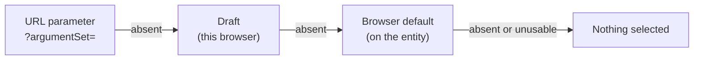

# Browser defaults for data graphs and argument sets

Status: accepted. Builds on [argument sets without graphs](argument-sets-without-graphs.md).

## Problem

A rule set always runs against a data graph. A query or a query group often
runs with the same argument set, and a group with the same data graphs. The web
app opened these screens with nothing selected, so each session started with a
pick.

A **browser default** is an opt-in default per entity. The web app applies it.
The API and MCP do not.

## What existed before

| Mechanism | Stored where | Who applies it |
| --- | --- | --- |
| `Query.defaultBackend`, `Library.defaultBackend` | Server, on the stable pointer | The API (`api/src/lib/defaultBackend.ts`) and the web app |
| Last backend pick (`web/src/lib/backendDefaults.ts`) | `localStorage`, one per query | The web app only, this browser only |
| Rule set draft body (`dataGraphVersionId`, inline graph) | `localStorage`, in the draft or scratch record | The web app only, and only while a draft exists |
| `?argumentSet=` URL parameter | The URL | The query screen, once on open |

There was no default data graph on `RuleSet` or `QueryGroup`, and no default
argument set on `Query` or `QueryGroup`.

## Model

| Entity | Default argument set | Default data graphs |
| --- | --- | --- |
| `Query` | `browserDefaultArgumentSet` | — |
| `QueryGroup` | `browserDefaultArgumentSet` | `browserDefaultDataGraphs`, one per start-node data graph input |
| `RuleSet` | — | `browserDefaultDataGraphs`, at most one |

- `browserDefaultArgumentSet` names an `ArgumentSet` (float) or an
  `ArgumentSetVersion` (pin).
- `browserDefaultDataGraphs` names `BrowserDefaultDataGraph` children. Each
  child has a `position` and a `dataGraph`, which is a `DataGraph` (float) or
  a `DataGraphVersion` (pin). RDF arrays carry no order, and a group routes
  graphs by position, so the position is stored. This is the same reason
  `TestCaseDataGraph` exists.
- A default argument set is **one** set. `/execute` can still compose several,
  but a default is a starting selection, and the screens select one set.

The UI label is **Browser default**. Its tooltip says: "Selected when this
opens in the web app. API and MCP calls ignore it."

## API

```http
GET /queries/:id/browser-defaults
PUT /queries/:id/browser-defaults
GET /query-groups/:id/browser-defaults
PUT /query-groups/:id/browser-defaults
GET /rule-sets/:id/browser-defaults
PUT /rule-sets/:id/browser-defaults
```

The body and the response have one shape:

```json
{ "argumentSet": "urn:…", "dataGraphs": ["urn:…", null, "urn:…"] }
```

- `PUT` replaces the whole value. `{}` clears it.
- `dataGraphs[n]` is the default for data graph input `n`. `null` leaves that
  input without a default.
- A field the entity kind does not take is refused with `400`: `dataGraphs`
  on a query, `argumentSet` on a rule set, more than one graph on a rule set.
- Every target must exist, be of the right type and belong to the entity's
  library. A library is the unit of export, so a cross-library default would
  dangle after an export.
- `PUT` needs write access to the entity's library. `GET` needs read access.
- `PUT` changes `dateModified` on the pointer. It does not create a version: a
  default is metadata, like `defaultBackend`.

### Cleanup

| Event | Effect |
| --- | --- |
| A data graph is deleted | Each `BrowserDefaultDataGraph` naming it or one of its versions is deleted |
| An argument set is deleted | Each `browserDefaultArgumentSet` naming it or one of its versions is cleared |
| A query, group or rule set is deleted | Its `BrowserDefaultDataGraph` children are deleted |

### Execution ignores it

`/execute`, rule set execute, tests, benchmarks and MCP run tools never read
a browser default. Tests assert this for queries, groups and rule sets.

## Web app

The order is the same on all three screens:



- A float resolves to the target's current version when it is applied.
- The picker marks the default with a "Browser default" badge.
- A pick for one run does not change the default.
- "Set as browser default" saves the current pick. It saves exactly what is
  selected, so a selected version is a pin. "Clear browser default" removes it.
- Both actions need write access. A read-only deployment hides them.
- A default that cannot be resolved (deleted, unreadable, or no longer
  fitting the current query) selects nothing. It never shows an error on open.

## Why the API does not apply it

Make the caller responsible. Four reasons:

1. **No arguments is a valid call.** A query with no arguments runs with
   `UNDEF` rows and its literal `LIMIT`. If the server filled in a default, an
   empty call would become ambiguous: "no arguments", or "the default"?
2. **The answer changes silently.** A backend says *where* a query runs. Data
   and arguments say *what* it computes. Someone can change a browser default
   in the UI, and every script that relies on it would get different results.
3. **The name tells the truth.** `defaultBackend` is honoured by the API. A
   plain `defaultDataGraph` would suggest the same. The `browser` prefix marks
   the difference.
4. **Opt-in stays possible.** `GET …/browser-defaults` is readable by anyone
   who can read the entity. A caller that wants the default reads it and sends
   it, and that choice is in its own code.

If an API default is ever needed, add an explicit request flag such as
`"useBrowserDefaults": true`. Do not make it implicit.

## Out of scope

- **Personal defaults.** A browser default is shared by everyone who uses the
  library, so it travels with the library and helps a new user.
- **A query data graph.** A query's store is its backend.
