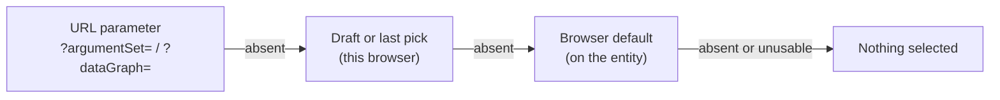

# Browser defaults for data graphs and argument sets

Status: proposal. Nothing here is built.

## Problem

A rule set always runs against a data graph. A query or a query group often
runs with the same argument set. Today the web app opens these screens with
nothing selected, so each session starts with a pick.

The user wants an opt-in default per entity. The web app applies it. The API
and MCP do not.

## What exists today

| Mechanism | Stored where | Who applies it |
| --- | --- | --- |
| `Query.defaultBackend`, `Library.defaultBackend` | Server, on the stable pointer | The API (`api/src/lib/defaultBackend.ts`) and the web app |
| Last backend pick (`web/src/lib/backendDefaults.ts`) | `localStorage`, one per query | The web app only, this browser only |
| Rule set draft body (`dataGraphVersionId`, inline graph) | `localStorage`, in the draft or scratch record | The web app only, and only while a draft exists |
| `Query.argumentSets`, `QueryGroup.argumentSets` | Server | A list of sets filed against the callable. No set is marked as preferred |
| `?argumentSet=` URL parameter | The URL | The query screen, once on open |

So: there is no default data graph on `RuleSet`. There is no default argument
set on `Query` or `QueryGroup`. The nearest thing is the draft body, and a
saved rule set with no open draft forgets its graph.

## Proposal

Add optional properties on stable pointers:

| Entity | Property | Points at |
| --- | --- | --- |
| `RuleSet` | `browserDefaultDataGraph` | One `DataGraph` (float) or `DataGraphVersion` (pin) |
| `Query` | `browserDefaultArgumentSets` | An ordered list of `ArgumentSet` (float) or `ArgumentSetVersion` (pin) |
| `QueryGroup` | `browserDefaultArgumentSets` | As for `Query` |

The UI label is **Browser default**.

### Why a list of argument sets, and no group data graph property

A query group can take arguments and one or more data graphs. The model
already covers both with argument sets:

- `POST /execute` takes `argumentSetIds` as a list.
  `ArgumentSetService.exportRuntimePayload` composes the sets: rows union per
  signature, and graphs concatenate.
- An `ArgumentSetVersion` can hold `ArgumentGraphBinding`s, one per
  start-node graph port.

So a group's graphs travel inside argument sets. A user can keep one set per
concern (for example, one set for the tuples and one set per graph) and list
them all as the default. The browser default is then exactly the
`argumentSetIds` the web app sends. It adds no new composition rule, and an
API caller can copy the list into its own request.

A separate `QueryGroup.browserDefaultDataGraphs` is not proposed. It would be
a second way to bind the same ports, and the two would need a precedence rule.

Most entities will have zero or one item in the list. The list form costs
nothing for that case.

### Rules

1. **Absent by default.** A new entity has no value. A user sets it with an
   explicit action. Nothing sets it as a side effect of a run.
2. **On the pointer, not the version.** It is metadata, like
   `defaultBackend`. Changing it must not create a version. It changes
   `dateModified` and the ETag, and it uses `If-Match` like any other `PATCH`.
3. **Pin or float.** A float follows the target's `currentVersion`. A pin
   holds one version. The picker offers "latest" and the version list. Every
   run already records the resolved version, so a float stays reproducible.
4. **Same library.** The target must be in the entity's library. A library is
   the unit of export, so a cross-library default would dangle after an export.
5. **Execution never reads it.** `POST /execute`, rule set execute, tests,
   benchmarks and MCP run tools ignore the property. A test asserts this.
6. **CRUD reads and writes it.** It is in `GET`, `PATCH`, export and import.
   A programmatic caller can read it and pass it on purpose.

### Web app precedence

The order matches `backendDefaults.ts`, so all three pickers behave the same.

- The picker marks the default with a "Browser default" badge.
- A user who picks a different value for one run does not change the default.
- "Set as browser default" and "Clear browser default" sit next to the
  picker. They need write access, so a read-only deployment hides them.

### When the default is unusable

| Case | Behaviour |
| --- | --- |
| Target deleted | Delete clears the reference, as backend delete clears `defaultBackend` |
| Argument set no longer fits the current query signature | The picker shows the default with a "does not fit" warning, and selects nothing |
| One set in a list is unusable | Select none of the list. A partial default gives a run that looks complete but is not |
| Two sets in a list fill the same graph port | Refuse on write, with the same check `exportRuntimePayload` needs (see open question 4) |
| Caller cannot read the target | Select nothing. Do not show an error on open |

The delete cleanup and "Clear browser default" both write `null`. Both depend
on the fix for review item C1 in `2026-09-review.md` (a `null` patch never
reaches the store). Without it, the old value comes back after a cache refresh.

## Why the API does not apply it

The user's instinct is correct. Make the caller responsible. Four reasons:

1. **No arguments is a valid call.** A query with no arguments runs with
   `UNDEF` rows and its literal `LIMIT`. A rule set with no data graph runs on
   its seeds. If the server filled in a default, an empty call would become
   ambiguous: "no arguments", or "the default"? Today it has one meaning.
2. **The answer changes silently.** A backend says *where* a query runs. Data
   and arguments say *what* it computes. Someone can change a browser default
   in the UI, and every script that relies on it gets different results with
   no change on its side.
3. **The name tells the truth.** `defaultBackend` is honoured by the API. A
   plain `defaultDataGraph` would suggest the same. The `browser` prefix in
   the property and the label marks the difference.
4. **Opt-in stays possible.** The property is readable. A caller that wants
   the default reads it and sends it. That choice is then in the caller's code.

### Possible use cases for an API default, and the answer

| Use case | Answer |
| --- | --- |
| An assistant on MCP says "run this rule set" with no graph | The tool reads `browserDefaultDataGraph` and passes it. The tool description says so. The receipt shows which graph was used |
| A scheduled job | Scheduled jobs must pin their inputs. A default that can change under them is a defect |
| A test or benchmark | They already name their inputs. No change |

If an API default is ever needed, add an explicit request flag such as
`"useBrowserDefaults": true`. Do not make it implicit.

## Open questions

1. **Label.** "Browser default" can be read as "stored in this browser". It is
   stored on the server and shared by all users of the library. A tooltip must
   say: "Selected when this opens in the web app. API and MCP calls ignore it."
   An alternative label is "Default in the editor".
2. **Shared or personal.** This design is shared, so it travels with an export
   and helps a new user. The per-browser last pick already covers personal
   preference. A personal server-side default is out of scope.
3. **Query data graph.** A hermetic query test can take a data graph. A
   `Query.browserDefaultDataGraph` is possible, but nothing on the query
   screen runs against a data graph today. Leave it out.
4. **Graph port collisions.** Each `ArgumentGraphBinding` carries a
   `position` for the group to route against. When two composed sets both
   bind position 0, check what `exportRuntimePayload` does today. If it only
   concatenates, execute has the same gap, and the fix belongs there first.

## Work

1. Contracts and schemas: add the properties to `RuleSet`, `Query` and
   `QueryGroup` (LDKit schema, generated contracts, routes).
2. API: same-library validation on write, for each item in a list. Clear on target delete. A test that
   each execute path ignores the property.
3. Web: picker badge, set and clear actions, the precedence above, the
   "does not fit" state.
4. MCP: say in the run tool descriptions that defaults are not applied, and
   how to read them.
5. Docs: `concepts.md` and `reference/entity-model.md`.
